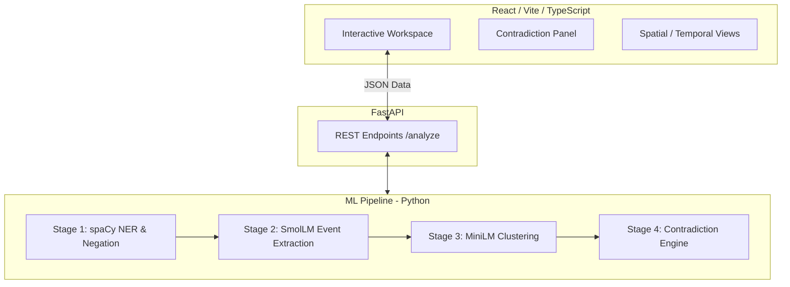
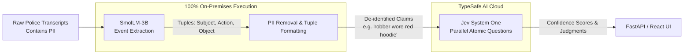
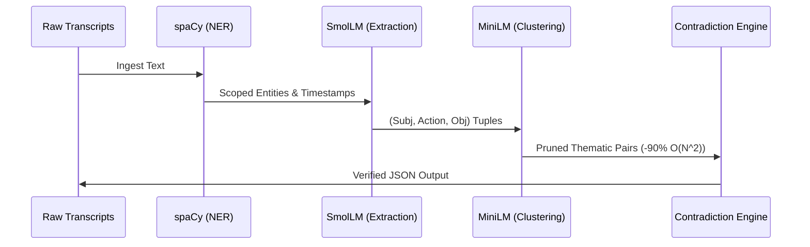

# Mermaid Diagrams for Silent Witness LaTeX Report

Use these diagrams to generate PNG images for the `\includegraphics` placeholders in your LaTeX report.
You can view these directly in VS Code (using a Markdown Preview extension) or copy them into the [Mermaid Live Editor](https://mermaid.live/) to export them as PNGs. Save the exported images to an `images/` folder in your project directory.

## Figure 1: High-Level System Architecture (`images/architecture.png`)

## Figure 2: Jev Hybrid Privacy Architecture (`images/jev_architecture.png`)

*(If you want to add this to Chapter 5)*

## Figure 3: The 5-Stage Pipeline (`images/pipeline.png`)

